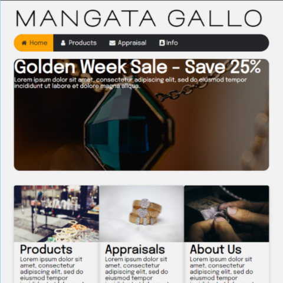

# Mangata-Gallo
This was a website I was tasked to create during my META certification.

## Table of contents

- [Overview](#overview)
  - [The challenge](#the-challenge)
  - [Screenshot](#screenshot)
  - [Links](#links)
- [My process](#my-process)
  - [Built with](#built-with)
  - [What I learned](#what-i-learned)
  - [Continued development](#continued-development)
  - [Useful resources](#useful-resources)
- [Author](#author)

## Overview

### The challenge

The challenge was to build a website for a fictional client. It needed to have the following:
  - Create a semantic structure with a header, main content, and footer using either flexbox or grid
    - Head will contain appropriate meta tags
    - Header will contain the client's logo
    - Main content will contain a large promotional banner and three columns with text and images
    - Footer will contain two columns; a smaller logo in the first and copywrite info in thesecond
  - HTML and CSS code are correctly formatted and valid
  - Styling should use your creativity for an appropriate look and feel
  - CSS selectors are not over-specific uses minimal selectors and rules
  - CSS effects and animations are complimentary and not distracting

### Screenshot



### Links

- Live Site URL: [Mangata-Gallo](https://caius-scipio.github.io/Mangata-Gallo/)

## My process

### Built with

- Semantic HTML5 markup
- CSS custom properties
- JavaScript

### What I learned

Making this site taught me a lot about making a website. Some of the key takeaways are using grids, reusing content but styling it differently, selecting better color palettes, and little details such as box shadows that can really liven up a page.

Here is some code I am particularly proud of, or think was interesting:

```css
.saleImage {
  background-image: linear-gradient(rgba(0, 0, 0, 0.5), rgba(0, 0, 0, 0.5)), url("https://...");
  min-height: 19rem;
  background-position: center;
  background-repeat: no-repeat;
  background-size: cover;
  position: relative;
  color: var(--white);
  border-radius: 15px;
}
```

### Continued development

There are many things I enjoy about this site, but looking back, I would like to have:
  - made the images increase in scale when hovering over them
  - added a black border around focused items
  - made the rounded corners more uniform
  - and fixed the copywrite information to the left.

### Useful resources

- META Course Material

## Author

- Website - [Caius Scipio](https://caius-scipio.github.io/Portfolio/)
